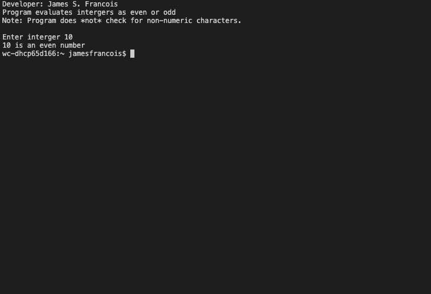
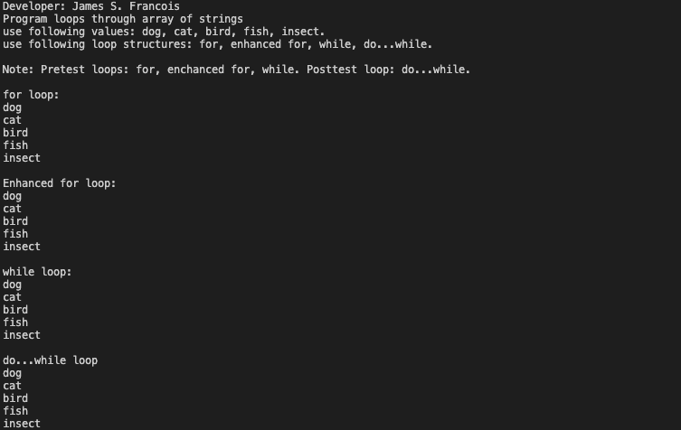

> **NOTE:** This README.md file should be placed at the **root of each of your main directory.**

# LIS 4381 

## James Francois

### Assignment 2 Requirements:

*Sub-Heading:*

1. Course title, your name, assignment requirements 
2. Screenshot of running application's first user interface
3. Screenshot of running application's second user interface

#### README.md file should include the following items:

* Course title, your name, assignment requirements 
* Screenshot of running application's first user interface
* Screenshot of running application's second user interface

#### Assignment Screenshots:

*Screenshot of running applications first user interface:

*Screenshot of running applications second user interface:

#### Skillsets Screenshots:

*Screenshot of Skillset 1:

*Screenshot of Skillset 2:

*Screenshot of Skillset 3:

#### Tutorial Links:

*Bitbucket Tutorial - Station Locations:*
[A1 Bitbucket Station Locations Tutorial Link](https://bitbucket.org/username/bitbucketstationlocations/ "Bitbucket Station Locations")

*Tutorial: Request to update a teammate's repository:*
[A1 My Team Quotes Tutorial Link](https://bitbucket.org/username/myteamquotes/ "My Team Quotes Tutorial")