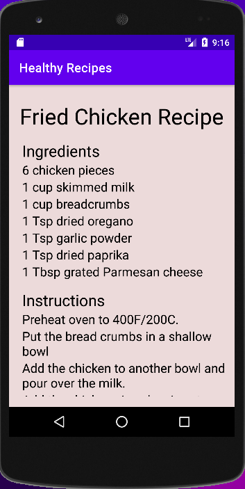
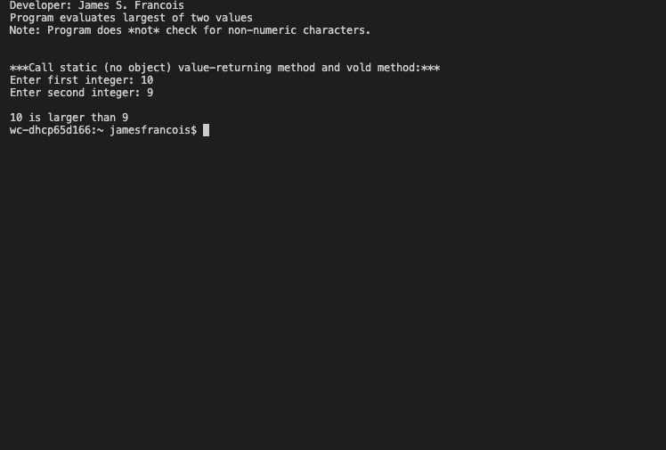

> **NOTE:** This README.md file should be placed at the **root of each of your main directory.**

# LIS 4381 

## James Francois

### Assignment 2 Requirements:

*Sub-Heading:*

1. Screenshot of running application's first user interface
2. Screenshot of running application's second user interface
3. Skillsets

#### README.md file should include the following items:

* Screenshot of running application's first user interface
* Screenshot of running application's second user interface
* Skillsets

#### Assignment Screenshots:

*Screenshot of running First User Interface

 

*Screenshot of running Second User Interface

*Screenshot of Skillset 1 

 

*Screenshot of Skillset 2 

*Screenshot of Skillset 3

#### Tutorial Links:

*Bitbucket Tutorial - Station Locations:*
[A1 Bitbucket Station Locations Tutorial Link](https://bitbucket.org/username/bitbucketstationlocations/ "Bitbucket Station Locations")

*Tutorial: Request to update a teammate's repository:*
[A1 My Team Quotes Tutorial Link](https://bitbucket.org/username/myteamquotes/ "My Team Quotes Tutorial")