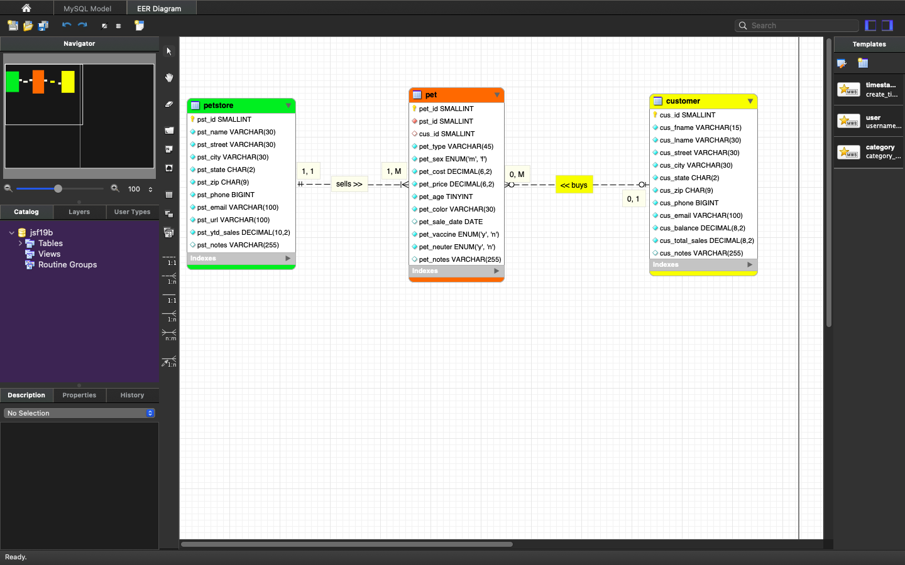

> **NOTE:** This README.md file should be placed at the **root of each of your main directory.**

# LIS 4381 

## James Francois

### Assignment 3 Requirements:

*Sub-Heading:*

1. Screenshot of ERD; 
2. Screenshot of running applications opening user interface; 
3. Screenshot of running applications processing user input; 
4. Screenshots of 10 records for each table; 
5. Links to the following files: a3.mwb, a3.sql; 

#### README.md file should include the following items:

* Screenshot of ERD; 
* Screenshot of running applications opening user interface; 
* Screenshot of running applications processing user input; 
* Screenshots of 10 records for each table; 
* Links to the following files: a3.mwb, a3.sql; 

#### Assignment Screenshots:

*Screenshot of ERD

 

*Screenshot of running applications opening user interface 

*Screenshot of running applications processing user input; 

 

*Screenshots of 10 records for each table; 

*Screenshot of Skillset 4

*Screenshot of Skillset 5

*Screenshot of Skillset 6

*Link to a3.mwb
[a3.mwb](docs/a3.mwb)

*Link to a3.sql
[a3.sql](docs/a3.sql)

#### Tutorial Links:

*Bitbucket Tutorial - Station Locations:*
[A1 Bitbucket Station Locations Tutorial Link](https://bitbucket.org/username/bitbucketstationlocations/ "Bitbucket Station Locations")

*Tutorial: Request to update a teammate's repository:*
[A1 My Team Quotes Tutorial Link](https://bitbucket.org/username/myteamquotes/ "My Team Quotes Tutorial")