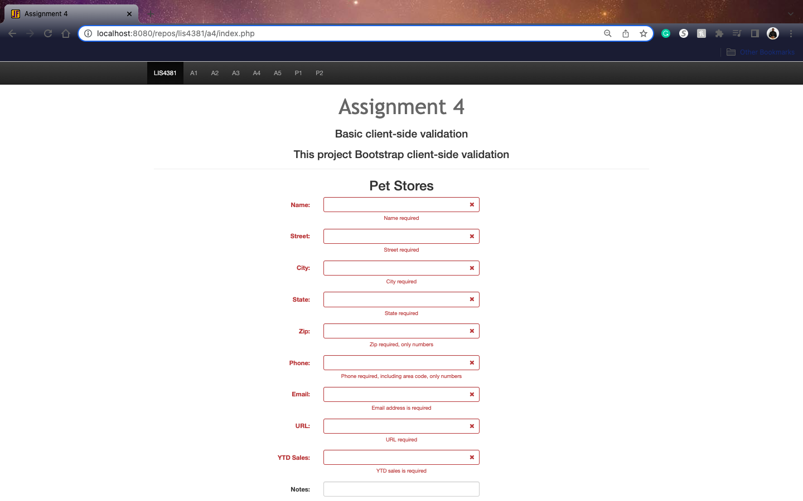

# LIS 4381 

## James Francois

### Assignment 4 Requirements:

*Sub-Heading:*

1. Course title, your name, assignment requirements, as per A1;
2. Screenshot of Failed Validation
3. Screenshot of Passed Validation 
4. Screenshots of Skillsets
5. Link to local lis4381 web app:

#### README.md file should include the following items:

* Course title, your name, assignment requirements, as per A1;
* Screenshot of Failed Validation 
* Screenshot of Passed Validation 
* Screenshots of Skillsets
* Link to local lis4381 web app: 

#### Assignment Screenshots:

*Link to local lIS4381 Web App

[Link to local lis4381 web app](http://localhost:8080/repos/lis4381/index.php)

*LIS 4381 Portal (Main Page)

 

*Failed Validation 

*Passed Validation 

 

*Screenshot of Skillset 10

*Screenshot of Skillset 11

*Screenshot of Skillset 12

#### Tutorial Links:

*Bitbucket Tutorial - Station Locations:*
[A1 Bitbucket Station Locations Tutorial Link](https://bitbucket.org/username/bitbucketstationlocations/ "Bitbucket Station Locations")

*Tutorial: Request to update a teammate's repository:*
[A1 My Team Quotes Tutorial Link](https://bitbucket.org/username/myteamquotes/ "My Team Quotes Tutorial")