# LIS 4381 

## James Francois

### Assignment 5 Requirements:

*Sub-Heading:*

1. Course title, your name, assignment requirements, as per A1; 
2. Screenshots of Petstore operations
3. Screenshots of Skillsets 

#### README.md file should include the following items:

* Course title, your name, assignment requirements, as per A1; 
* Screenshots of Petstore operations
* Screenshots of Skillsets 

#### Assignment Screenshots:

*Screenshot of Petstore Index 

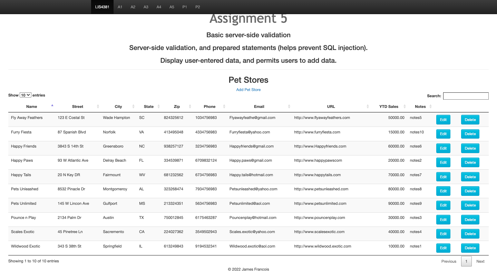

*Screenshot of Failed Validation Add Petstore; 

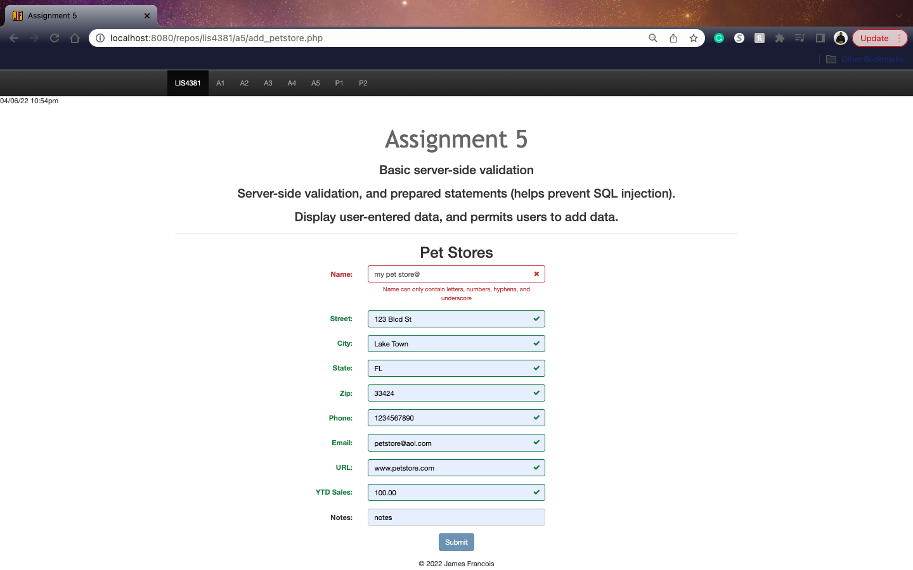 

*Screenshot of invalid Add Petstore Error; 

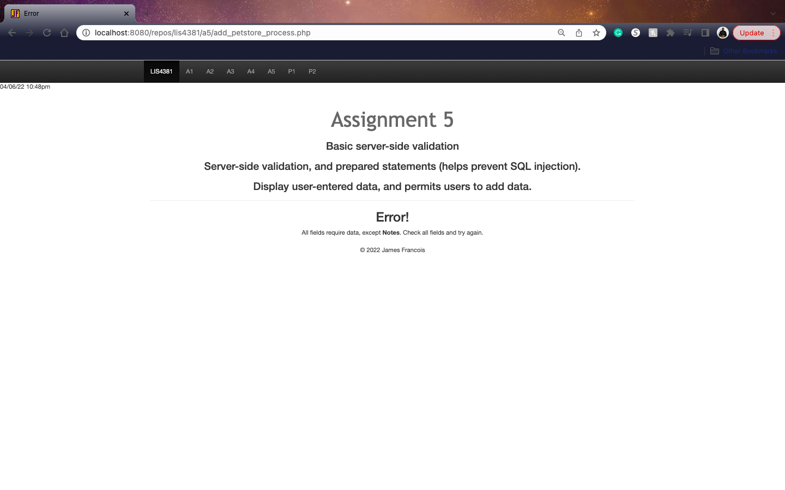 

*Screenshot of Valid Add Petstore ; 

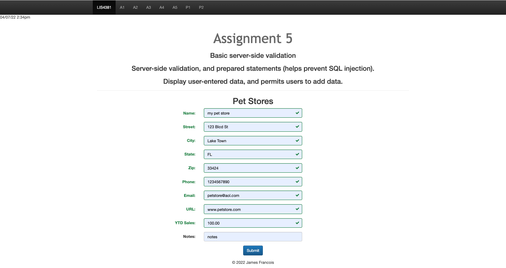 

*Screenshot of Passed Validation; 

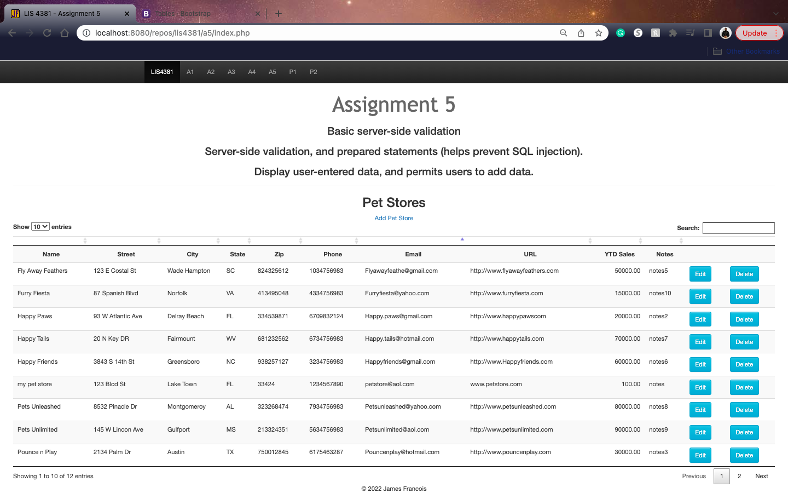 

*Screenshot of Skillset 13

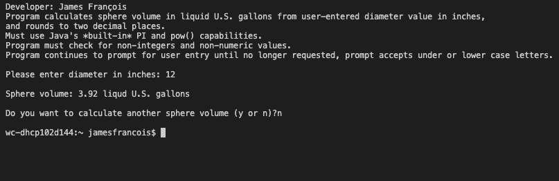

*Screenshot of Skillset 14 Index Addition

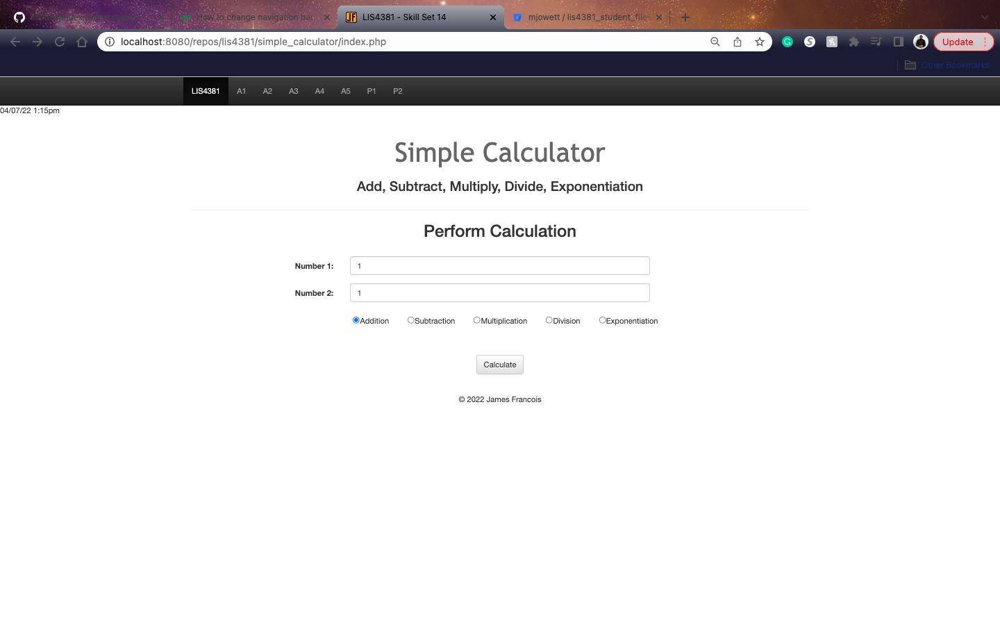

*Screenshot of Skillset 14 Process Addition

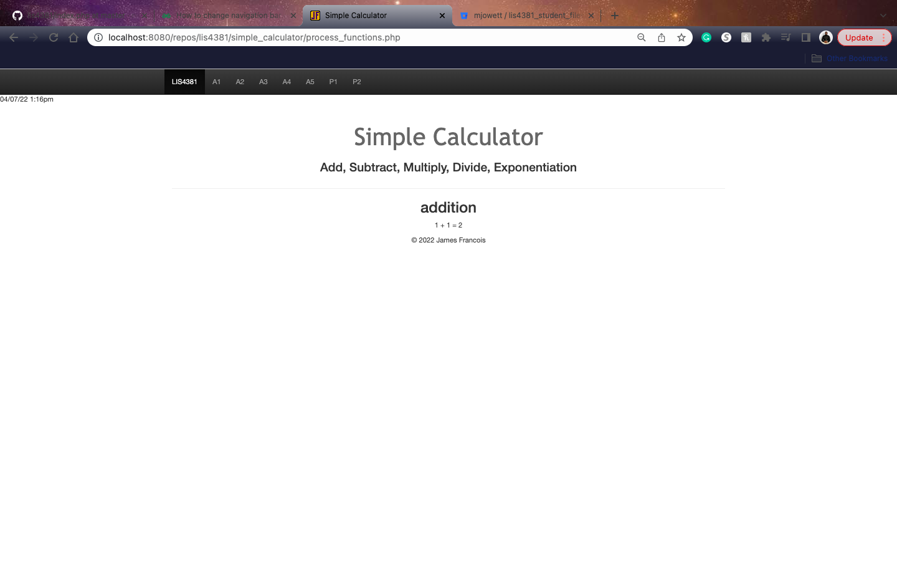

*Screenshot of Skillset 14 Process Divison

*Screenshot of Skillset 14 Process Divison

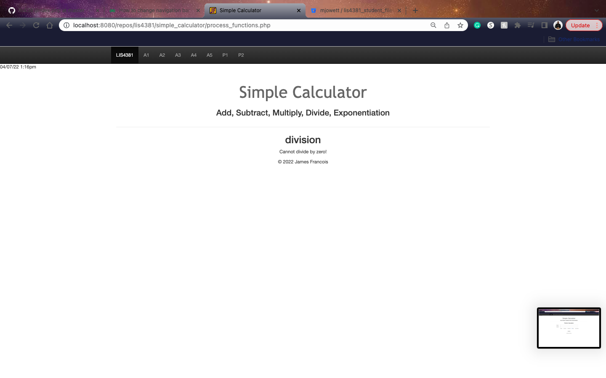

*Screenshot of Skillset 15 Index 

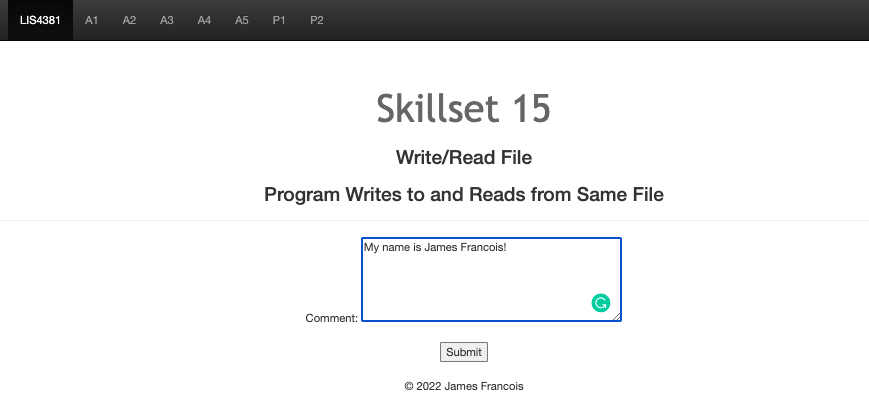

*Screenshot of Skillset 15 Process

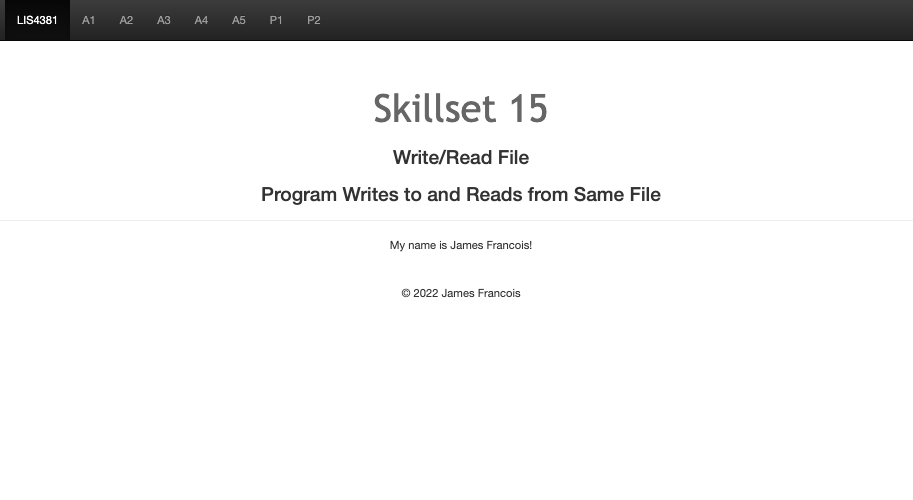