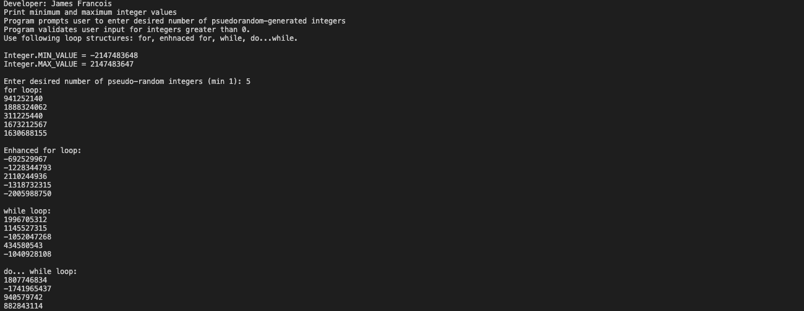
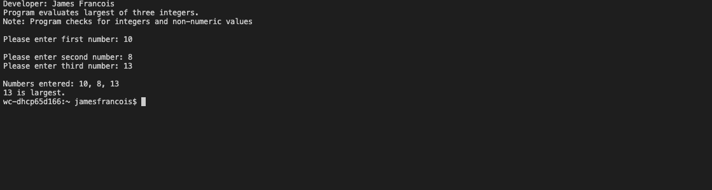
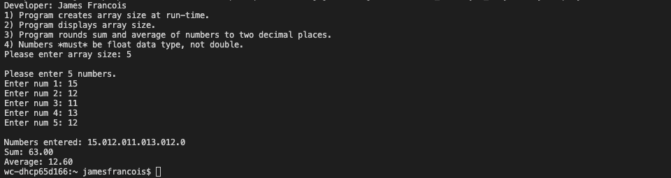

# LIS 4381 

## James Francois

### Assignment 3 Requirements:

*Sub-Heading:*

1. Course title, your name, assignment requirements, as per A1; 
2. Screenshot of running applications first user interface; 
3. Screenshot of running applications second user interface;
4. Screenshots of Skillsets 

#### README.md file should include the following items:

* Course title, your name, assignment requirements, as per A1; 
* Screenshot of running applications first user interface; 
* Screenshot of running applications second user interface;
* Screenshots of Skillsets 

#### Assignment Screenshots:

*Screenshot of running applications opening user interface 

*Screenshot of running applications processing user input; 

 

*Screenshot of Skillset 7

*Screenshot of Skillset 8

*Screenshot of Skillset 9

