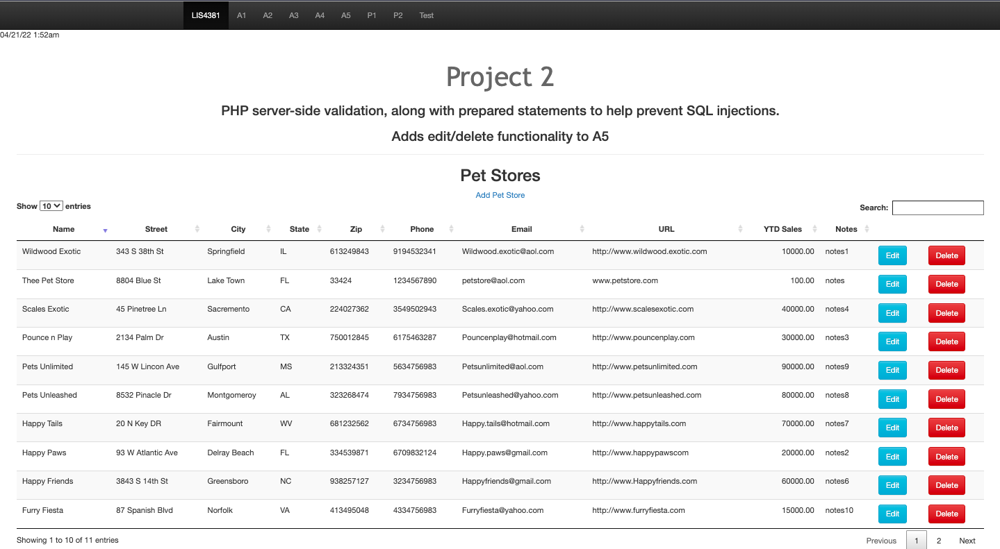

# LIS 4381 

## James Francois

### Project 2 Requirements:

*Sub-Heading:*

1. Course title, your name, assignment requirements, as per A1; 
2. Screenshot of Petstore Index 
3. Screenshot of Edit Petstore 
4. Screenshot of Failed Validation 
5. Screenshot of Passed Validation 

#### README.md file should include the following items:

* Course title, your name, assignment requirements, as per A1; 
* Screenshot of Petstore Index 
* Screenshot of Edit Petstore 
* Screenshot of Failed Validation 
* Screenshot of Passed Validation 

#### Assignment Screenshots:

*Screenshot of Petstore Index 

*Screenshot of Edit Petstore 

 

*Screenshot of Failed Validation 

 

*Screenshot of Passed Validation 

 

*Screenshot of Delete Prompt 

 

*Screenshot of Sucessful Deleted Record

 

*Screenshot of RSS Feed

 
